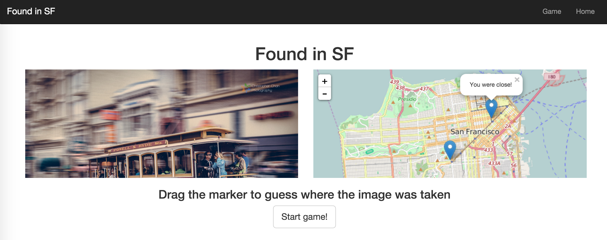

# Found in SF

## How it works
* Move the marker on the map to guess where the image was taken
* Click "Guess!" to find out where the picture was taken

## Technologies
* MEAN stack
* Javascript
* Mapbox

## About
I built this as a weekend project to use MEAN stack for the first time. I wanted to use the Flickr API for my data but for a short-term project, it was easier to seed my data. 

#Future plans
I intend to add more pictures, and possibly a score counter.